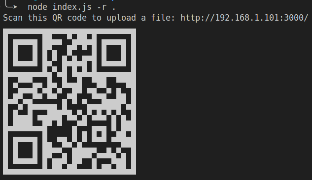

# ShareFile-QR

Transfer files over WiFi between your computer and your smartphone from the terminal using QR codes.




## Features

- Upload files to a specified directory on your server.
- Download files from the server.
- Generate QR codes for easy file sharing.

## Requirements

- Node.js (v12 or later)

## Installation

1. Clone the repository:

   ```bash
   git clone https://github.com/maanimis/shareFile-QR
   cd shareFile-QR

2. Install the dependencies:

```bash
npm install
```

## Usage
### Upload Mode

Start the server in upload mode by specifying the root directory where files should be uploaded:

```bash
node src/index.js --root . --port 3000 --ip 192.168.0.101
```

This will start the server and generate a QR code. Scan the QR code with your smartphone to access the upload interface.

### Download Mode

Start the server in download mode by specifying the file to download:

```bash
node index.js --download /path/to/file --port 3000 --ip 192.168.0.101
```
This will start the server and generate a QR code. Scan the QR code with your smartphone to download the specified file.


This command starts the server on port 3000, using the local IP address 192.168.1.100, and sets the root directory for uploads to ./uploads.

## Command-line Options

```
─➤  node index.js -h                                               
Options:
      --version        Show version number                       
  -r, --root           Root directory path to save/upload files   
  -p, --port           Port number                 [default: 3000]
      --ip_addr, --ip  IP address       [default: "192.168.1.101"]
      --download       File to download                           
  -h, --help           Show help    
```     
